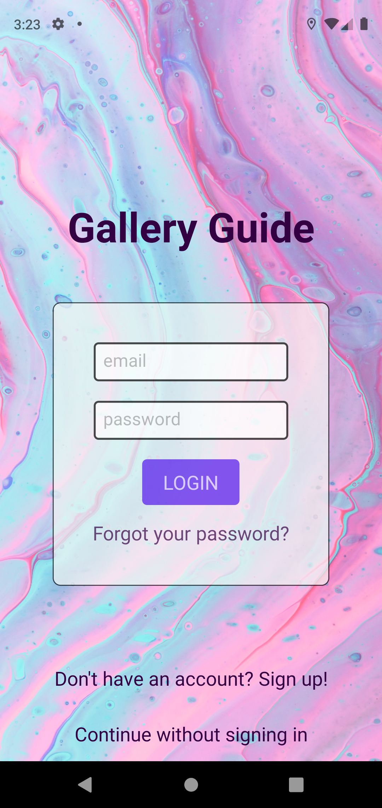
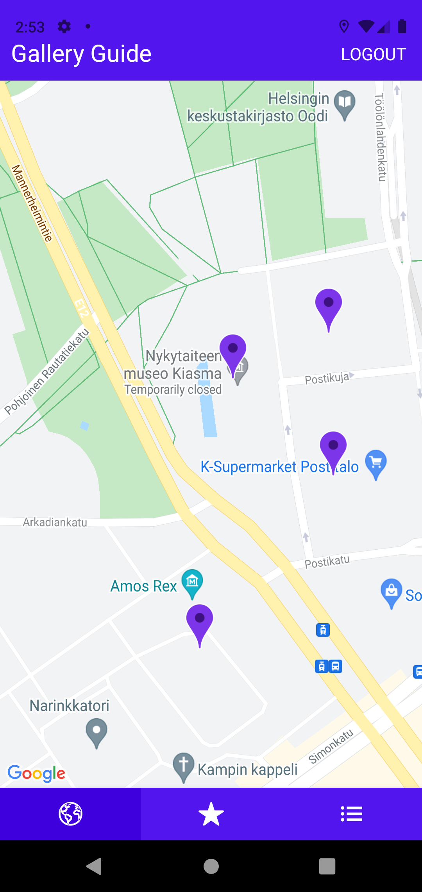
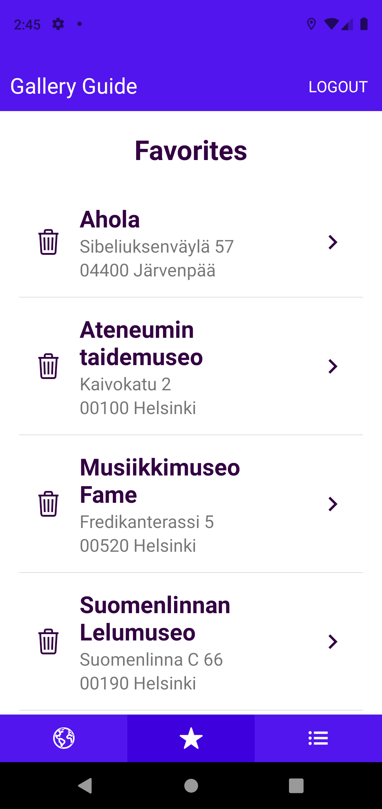
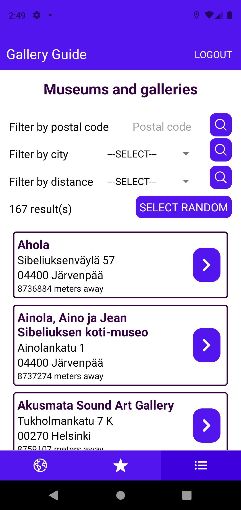
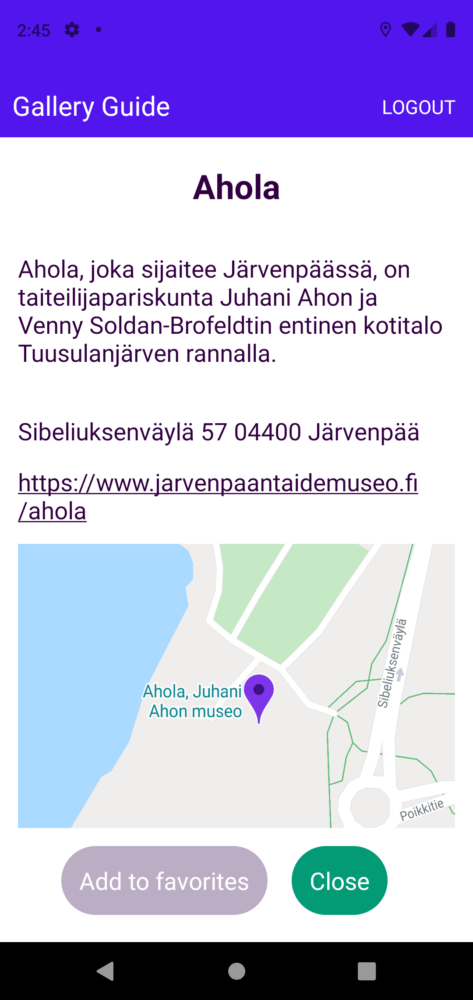

# GalleryGuide

## About

Gallery Guide is a mobile app created to help users to find museums and art galleries in the Helsinki area. It fetches data from MyHelsinki open API and shows all museums 
and galleries to the user on a map and as a list. On the list page user can filter the places by postal code, city or by distance to their current location. User can also get a 
random place shown. 

All museums and galleries have a page, where some basic information, link to their website and their location on a map are shown. Registered users can save their favorite museums and galleries 
to their own favorites page.

Gallery Guide was created as a part of Mobile Programming course at Haaga-Helia University of Applied Sciences and it has been published on Expo Go: https://expo.io/@miimss/projects/galleryguide

  
  
  
  
  

## Technologies and libraries

* Expo framework and platform for React Applications https://docs.expo.io/
  * Expo Location for getting user's location https://docs.expo.io/versions/latest/sdk/location/
* React Navigation's Bottom-Tab and Stack navigation with addittional packages it needs https://reactnavigation.org/
* Google Firebase Database as a database and for authentication https://firebase.google.com/
* React Native Maps for creating the map https://github.com/react-native-maps/react-native-maps
* React Native Elements for creating some UI elements https://reactnativeelements.com/
* React Native Picker as a dropdown picker https://github.com/react-native-picker/picker
* Geolib for calculating distances https://www.npmjs.com/package/geolib
* React Native Dotenv for creating dotenv-file for Firebase configurations https://www.npmjs.com/package/react-native-dotenv
